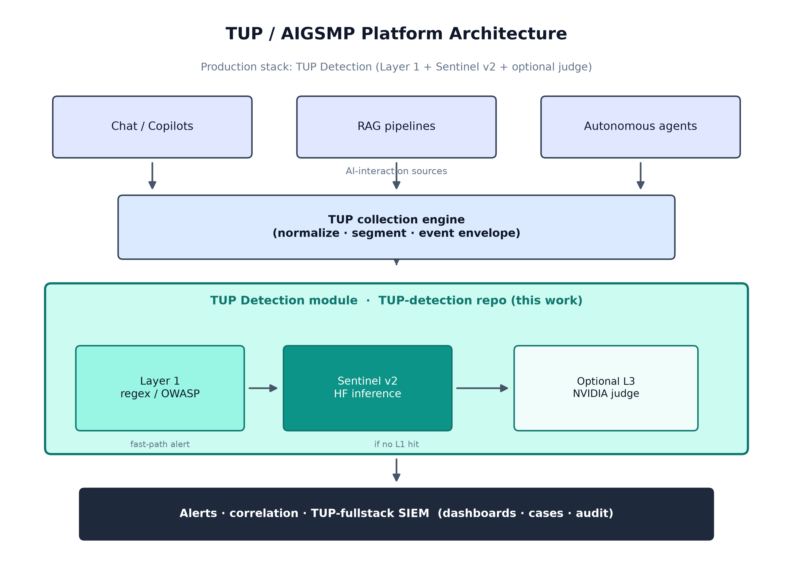
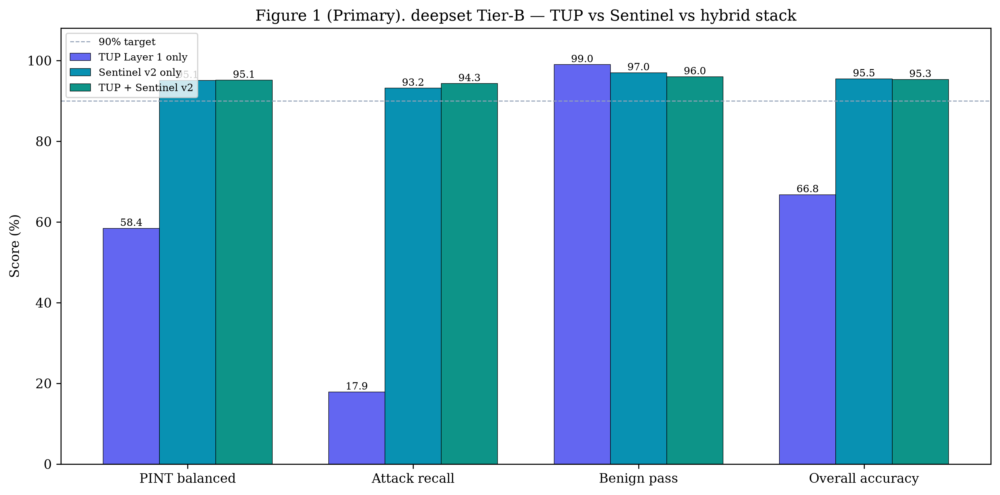
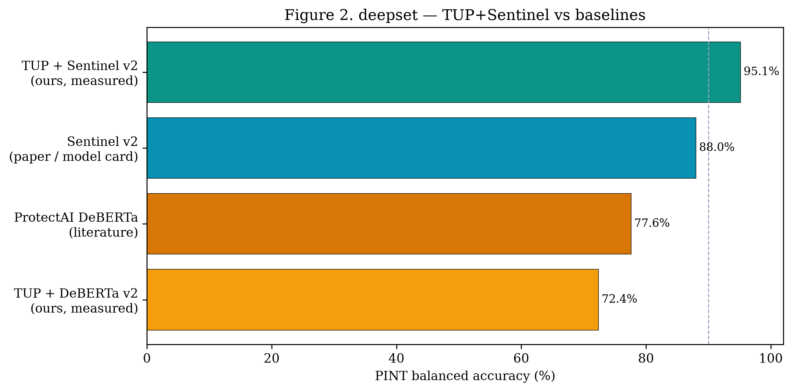
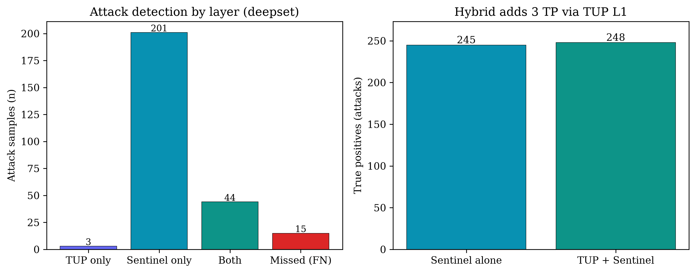
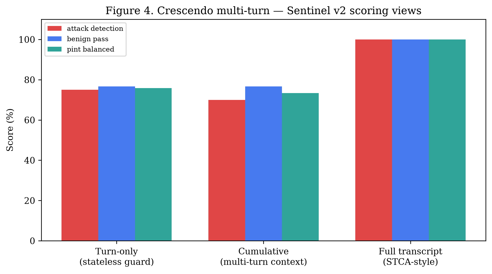
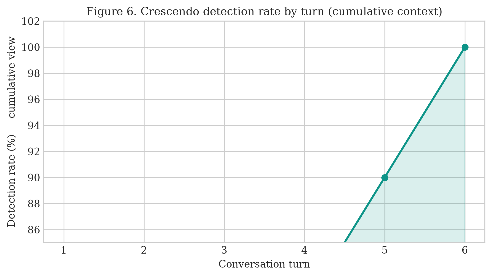

<div align="center">

<!-- Project Logo — colocá el archivo del logo en la raíz del repo -->


<p align="center">
  <strong>Hybrid Prompt-Injection Guard — Detection Engine of the TUP AIGSMP</strong>
</p>

<!-- Badges -->
[](LICENSE)
[]()
[]()
[]()

<p align="center">
  <a href="#about-the-project">About</a> •
  <a href="#core-architecture">Architecture</a> •
  <a href="#results">Results</a> •
  <a href="#evaluation">Evaluation</a> •
  <a href="#getting-started">Getting Started</a> •
  <a href="#repository-structure">Structure</a> •
  <a href="#configuration-reference">Configuration</a>
</p>

<p align="center">
  <a href="https://github.com/notyorch/TUP-fullstack">
    
  </a>
</p>

</div>

---

## About the Project

**TUP Detection** is the **prompt-injection detection engine** of **TUP** — an enterprise-grade, open-core **AI Governance and Security Monitoring Platform (AIGSMP)**. It is the analytical core that powers the **TUP Manager** service: a hybrid pipeline that evaluates LLM inputs and outputs against deterministic policies and neural classifiers, then emits structured, OWASP-mapped security alerts to the wider platform.

Unlike traditional SIEM detection rules designed for OS-level or network-level events, TUP Detection operates directly at the **intelligence layer** — scoring prompts, system instructions, and model responses to catch jailbreaks, instruction overrides, and multi-turn adversarial steering.

> This repository is the standalone detection & benchmarking module. It plugs into the full platform at **[notyorch/TUP-fullstack](https://github.com/notyorch/TUP-fullstack)**.

---

## Core Architecture

TUP Detection is the **TUP Manager** brain inside the wider AIGSMP platform: the Collector intercepts LLM telemetry, the Manager scores it, the Indexer persists alerts, and the Dashboard surfaces them.



Within the Manager, the engine runs a **multi-layer, fail-safe pipeline (M1–M5)**. Cheap deterministic checks run first; the neural classifier only runs when no rule fires, and an optional LLM judge arbitrates the gray zone.

```mermaid
flowchart TD
    X(["Prompt / LLM output"])

    X --> M1
    M1["M1 Normalize + segment<br/><i>text_normalize · prompt_segments</i>"]
    M1 --> M2
    M2["M2 Build variant set V(x)<br/><i>raw · normalized · per-segment</i>"]

    M2 --> M3
    M3["M3 L1 Regex policy<br/><i>policies/rules/</i>"]
    M3 -- hit --> ALERT["🚨 ALERT<br/><i>rule_id, OWASP-mapped</i>"]
    M3 -- no hit --> M4

    M4["M4 Sentinel v2 — max s(v) over V(x)<br/><i>injection_classifier (HF endpoint)</i>"]
    M4 --> L3
    L3["L3 LLM judge (optional)<br/><i>nvidia_judge_engine</i>"]
    L3 -. gray zone s ∈ [0.15, 0.85] .-> M4

    M4 --> M5
    M5["M5 Threshold τ → verdict → structured alert → TUP-fullstack"]
```

| Layer | Component | Characteristics |
|-------|-----------|-----------------|
| **L1** | OWASP-mapped regex (`policies/rules/`) | Deterministic, zero-latency, traceable `rule_id` |
| **L2** | Sentinel v2 (HF Inference Endpoint) | Neural classifier, paraphrase-robust, no fine-tuning |
| **L3** *(optional)* | LLM judge (NVIDIA NIM — Llama 3.1) | Gray-zone arbitration for `s ∈ [0.15, 0.85]` |

The engine monitors **both inputs and outputs** — bidirectional scoring catches attacks that are only observable after the model has been steered.

### Detection modes

| Mode | τ | Benign guard | Use |
|------|---|--------------|-----|
| `benchmark` | 0.15 | off | Tier-B evaluation / max recall |
| `production` | 0.50 | on | Live traffic / FP suppression |

---

## Results

Primary benchmark: **[deepset/prompt-injections](https://huggingface.co/datasets/deepset/prompt-injections)** (n = 662, Tier B).
Metric: **PINT balanced accuracy** = ½ (attack recall + benign specificity).

| System | PINT Balanced Accuracy |
|--------|:----------------------:|
| TUP + DeBERTa *(legacy baseline)* | 72.4% |
| Sentinel v2 *(model card, indirect)* | ~88% |
| **TUP + Sentinel v2 (this repo)** | **95.1%** |

Stack ablation on deepset (τ = 0.15):

| Stack | PINT | Attack recall | Benign pass | TP | FN | FP |
|-------|:----:|:-------------:|:-----------:|:--:|:--:|:--:|
| L1 only | 58.4% | 17.9% | 99.0% | 47 | 216 | 4 |
| Sentinel only | 95.1% | 93.2% | 97.0% | 245 | 18 | 12 |
| **Hybrid** | **95.1%** | **94.3%** | **96.0%** | **248** | **15** | 16 |

> PINT is rounded to one decimal: the hybrid stack trades slightly more false positives for higher attack recall, so both rows land at 95.1%.

On **[Crescendo](https://arxiv.org/abs/2404.01833)** multi-turn adversarial dialogues (n = 10), full-transcript scoring achieves **100% attack recall**.

> Frozen score caches in `notebooks/data/external/results/` reproduce all metrics **without re-querying the inference endpoint**.

---

## Evaluation

### Test 1 — Single-turn injection detection (deepset, n = 662)

Stack ablation across four metrics. Layer 1 alone protects benign traffic (99% pass rate) but catches only 18% of attacks. Sentinel v2 alone provides strong recall. The hybrid retains Tier-B PINT accuracy while adding 3 explainable catches that Sentinel misses, each with traceable `rule_id` attribution.



### Test 2 — Comparison against public baselines

TUP + Sentinel v2 measured on the same deepset split vs. our legacy TUP + DeBERTa stack and publicly reported baselines. Literature values (Sentinel v2 model card, ProtectAI DeBERTa) use different evaluation conditions — comparison is approximate.



### Test 3 — Layer complementarity (what each layer catches)

Among the 263 attack samples, the two layers are complementary: 201 detected by Sentinel alone, 44 by both, and **3 exclusively by Layer 1** — those 3 carry `rule_id` attribution traceable to OWASP-mapped patterns in `policies/rules/`, something no classifier provides. Adding Layer 1 recovers them at a cost of +4 FP over Sentinel alone.



### Test 4 — Multi-turn attack detection (Crescendo, n = 10 dialogues)

Crescendo attacks gradually escalate across conversation turns — early turns appear benign. A stateless per-turn guard misses 25% of attacks. Full-transcript scoring feeds the complete conversation to the classifier and achieves **100% attack recall** across all 10 dialogues.



First detection occurs at turn 2.7 on average; all conversations are flagged by turn 6.



---

## Getting Started

### Prerequisites

* Python 3.10+
* A Hugging Face account (Read token + accepted Sentinel v2 license)
* *(optional, L3 judge)* An NVIDIA NIM API key

### 1. Install

```bash
python3 -m venv .venv-pint && source .venv-pint/bin/activate
pip install -r scripts/requirements-pint.txt
pip install -r tup-manager/requirements.txt
```

### 2. Configure

```bash
cp notebooks/.env.pint.example .env
```

Then edit `.env` with your secrets (see [Configuration Reference](#configuration-reference)):

```bash
SENTINEL_API_KEY=hf_...                 # HF token (Read scope, license accepted)
HF_INFERENCE_ENDPOINT=https://xxxxx.aws.endpoints.huggingface.cloud
NVIDIA_JUDGE_API_KEY=nvapi-...          # optional — only for the L3 judge

DETECTION_MODE=benchmark                # or: production
BENIGN_GUARD_ENABLED=false              # true for production
```

> ⚠️ `.env` holds live secrets and is already in `.gitignore` — never commit it.

### 3. Deploy the Sentinel v2 Inference Endpoint

Sentinel v2 is a gated model — accept the license first.

1. Accept at **[rogue-security/prompt-injection-jailbreak-sentinel-v2](https://huggingface.co/rogue-security/prompt-injection-jailbreak-sentinel-v2)**
2. Create an endpoint at **[ui.endpoints.huggingface.co/new](https://ui.endpoints.huggingface.co/new)**
   - Model: `rogue-security/prompt-injection-jailbreak-sentinel-v2`
   - Task: **Text Classification** · Instance: **CPU** · Scale-to-zero: **ON**
3. Paste the endpoint URL into `.env` (`HF_INFERENCE_ENDPOINT`)

### 4. Verify

```bash
python scripts/verify_hf_endpoint.py
```

### 5. Run the benchmark

```bash
# Automated (import deepset + benchmark)
./scripts/run_sentinel_tier_b.sh

# Manual
python scripts/import_external_dataset.py --preset deepset \
  --out notebooks/data/external/deepset.yaml

python scripts/run_pint_benchmark.py \
  --dataset notebooks/data/external/deepset.yaml \
  --detection-mode benchmark \
  --results-out notebooks/data/external/results/deepset-sentinel.json
```

### Run the test suite

```bash
pytest tup-manager/tests/ -v
```

---

## Repository Structure

```text
TUP-detection/
├── tup-manager/                    # Detection engine (TUP Manager core)
│   ├── tup_manager/
│   │   ├── detection_engine.py     # Pipeline orchestration (M1–M5)
│   │   ├── injection_classifier.py # Sentinel v2 backend (hf / local)
│   │   ├── prompt_segments.py      # Context/user segment parser
│   │   ├── text_normalize.py       # Input normalization (M1)
│   │   ├── rules_engine.py         # L1 regex dispatch
│   │   ├── benign_guard.py         # FP suppression for production
│   │   ├── ensemble_classifier.py  # Optional Llama Prompt Guard 2
│   │   └── nvidia_judge_engine.py  # Optional L3 LLM judge (NVIDIA NIM)
│   └── tests/                      # Unit tests (pytest)
│
├── policies/
│   └── rules/                      # OWASP-mapped regex rules (YAML)
│
├── scripts/
│   ├── run_pint_benchmark.py       # Main benchmark + detection modes
│   ├── run_stack_ablation_benchmark.py
│   ├── run_crescendo_benchmark.py
│   ├── import_external_dataset.py  # deepset / OWASP v2 / Antijection
│   ├── verify_hf_endpoint.py       # Endpoint smoke test
│   └── requirements-pint.txt
│
└── notebooks/
    ├── benchmark.ipynb
    ├── tup_detection_guard_benchmark_report.ipynb
    ├── tier_b_guard_comparison.ipynb
    ├── data/external/results/      # Frozen benchmark JSON results
    └── .env.pint.example
```

---

## Configuration Reference

| Variable | Default | Description |
|----------|---------|-------------|
| `SENTINEL_API_KEY` | — | HF token (also accepted as `HF_TOKEN`) |
| `HF_INFERENCE_ENDPOINT` | — | Deployed Sentinel v2 endpoint URL |
| `DETECTION_MODE` | `production` | `benchmark` or `production` |
| `INJECTION_THRESHOLD` | `0.5` | Production threshold τ |
| `INJECTION_THRESHOLD_STRICT` | `0.15` | Benchmark threshold τ |
| `BENIGN_GUARD_ENABLED` | `true` | FP suppression for doc-like inputs |
| `INJECTION_FAIL_OPEN` | `true` | On inference failure: `true` → benign (0.0), `false` → malicious (1.0) |
| `HF_INFERENCE_TIMEOUT` | `180` | Seconds per request before retry |
| `HF_INFERENCE_RETRIES` | `5` | Max retry attempts (scale-to-zero cold start) |
| `DETECTION_JUDGE_ENABLED` | `auto` | Enable the L3 LLM judge |
| `NVIDIA_JUDGE_API_KEY` | — | NVIDIA NIM key for the L3 judge |
| `NVIDIA_JUDGE_MODEL` | `meta/llama-3.1-8b-instruct` | Judge model |
| `JUDGE_THRESHOLD` | `0.65` | Judge decision threshold |

### Troubleshooting

| Symptom | Fix |
|---------|-----|
| `401` / `403` | Token scope or model license not accepted |
| `503` / model not supported | Use a dedicated **Inference Endpoint**, not the serverless free tier |
| Score always `0` | Endpoint not Running or wrong URL |
| Slow first request | Scale-to-zero cold start — a warmup request is sent automatically |

---

## Citation

If you use TUP Detection in your research or build on its benchmarks, please cite it:

```bibtex
@software{tup_detection_2026,
  author  = {Vargas Pech, Jorge Enrique and Fern{\'a}ndez Castillo, William Emmanuel and Ruiz Pe{\~n}a, Sa{\'u}l and Rej{\'o}n Quintal, Jose Luis},
  title   = {TUP Detection: A Hybrid Tier-B Prompt-Injection Engine for the TUP AIGSMP Platform},
  year    = {2026},
  url     = {https://github.com/notyorch/TUP-detection},
  note    = {Detection engine of the TUP AI Governance \& Security Monitoring Platform (AIGSMP)}
}
```

---

## Authors & Acknowledgements

Built by **Jorge Vargas Pech, William Fernández Castillo, Saúl Ruiz Peña, and Jose Luis Rejón Quintal** as the detection module of **[TUP-fullstack](https://github.com/notyorch/TUP-fullstack)**.

Powered by [Sentinel v2](https://huggingface.co/rogue-security/prompt-injection-jailbreak-sentinel-v2),
evaluated on [deepset/prompt-injections](https://huggingface.co/datasets/deepset/prompt-injections)
and [Crescendo](https://arxiv.org/abs/2404.01833) multi-turn attacks.

---

## License

This project is licensed under the MIT License — see the [LICENSE](LICENSE) file for details.
